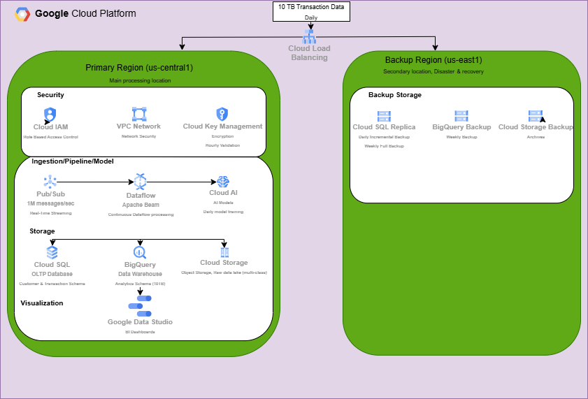

# Aetheron Cloud Data Solution

Academic project for Google Cloud Platform migration planning.

## Overview

Cloud data solution architecture for Aetheron's e-commerce platform using Google Cloud Platform. Designed to handle 10TB daily transaction data with real-time processing, high availability, and compliance.

## Architecture

### Database Schema

### Cloud Architecture  

## Requirements

### Functional
- **Real-time Data Processing**: Process and analyze 10TB daily transaction data in real-time

### Non-Functional
- **High Availability**: 99.99% uptime with multi-region deployment
- **Scalability**: Horizontal scaling across zones and regions
- **Security**: Encryption at rest/transit, IAM, secure by default/design
- **Backup & Recovery**: Daily incremental + weekly full backups
- **Compliance**: ISO 27001, SOC 2, GDPR, PCI DSS

## GCP Services

| Service | Purpose |
|---------|---------|
| Cloud Pub/Sub | Real-time message streaming (10TB/day) |
| Cloud Dataflow | Stream/batch data processing |
| BigQuery | Data warehouse for analytics |
| Cloud SQL | PostgreSQL OLTP database |
| Cloud Storage | Backup storage (immutable/indelible) |
| Cloud IAM | Access management |
| VPC Network | Network security |
| Cloud Load Balancing | Global traffic distribution |
| Vertex AI | Machine learning models |

## Database Tables

**Schema**: `public`

### Customer
- `customer_id` (VARCHAR(36)) - PK
- `name`, `email`, `phone`, `address`

### Shopping Cart
- `cart_id` (UUID) - PK
- `customer_id` (VARCHAR(36)) - FK → Customer

### Product
- `product_id` (VARCHAR(36)) - PK  
- `cart_id` (UUID) - FK → Shopping Cart
- `vendor`, `product_category`, `product_name`
- `quantity` (INTEGER), `price` (NUMERIC(10,2))

### Transactions
- `transaction_id` (VARCHAR(36)) - PK
- `customer_id` (VARCHAR(36)) - FK → Customer
- `cart_id` (UUID) - FK → Shopping Cart
- `transaction_date`, `shipping_method`, `total_amount`

## Architecture Highlights

### Primary Region (us-central1)
- **Security**: Cloud IAM, VPC Network, Cloud Key Management
- **Pipeline**: Pub/Sub → Dataflow → Cloud AI
- **Storage**: Cloud SQL, BigQuery, Cloud Storage
- **Visualization**: Google Data Studio

### Backup Region (us-east1)
- Cloud SQL Replicas (daily incremental, weekly full)
- BigQuery Backup (staging)
- Cloud Storage Backup (archives)

## Backup Strategy

- **Daily**: Incremental backups (cost-effective, frequent)
- **Weekly**: Full backups (complete snapshots)
- **Storage**: Immutable (cannot change) + Indelible (cannot delete)
- **Replication**: Multi-region (us-central1 → us-east1)
- **RTO**: < 4 hours
- **RPO**: < 1 hour

## Security

### Data Protection
- Encryption at rest (AES-256)
- Encryption in transit (TLS 1.3)
- Cloud Key Management Service

### Access Control
- IAM policies (least privilege)
- Multi-factor authentication
- Role-based access control

### Monitoring
- Continuous threat detection
- Security Command Center
- Cloud Logging & Monitoring

### Compliance
- GDPR (EU data protection)
- CCPA (California privacy)
- PCI DSS (payment card security)
- HIPAA (healthcare - if applicable)
- SOX, ISO 27001, SOC 2, NIST Framework

## Scalability

**Horizontal Scaling** (preferred for cloud):
- More machines/nodes vs. scaling single machine
- Cost-effective and cloud-native
- Auto-scaling based on demand
- No single point of failure

## High Availability

- Multi-region deployment (primary + backup)
- Global load balancing
- Automatic failover (< 5 minutes)
- Cloud DNS failover
- Managed database replication
